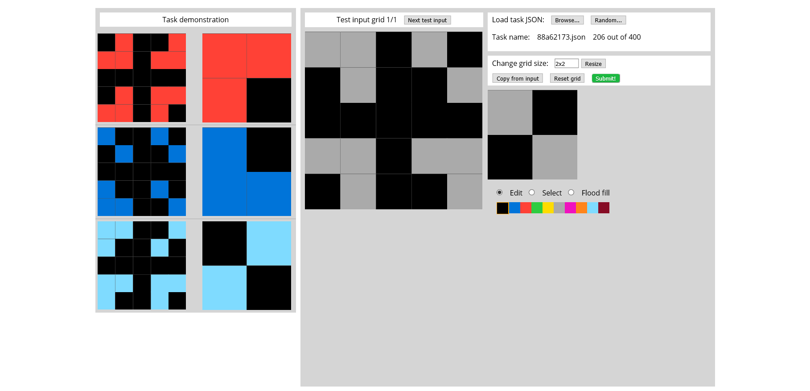

# Arc Labelled

## Labelling

`label.csv` contains five columns:

- **filename**
- **intr in?**: `Y` if the inputs are regular / have a pattern **independent** of output, so we can generate more input based on such pattern.
- **intr out?**: `Y` if the outputs are regular / have a pattern **independent** of input, so we can generate more input based on such pattern.
- **un in**: a list of inputs that are unusual i.e. have a different pattern than other inputs
- **un out**: a list of outputs that are unusual i.e. have a different pattern than other outputs
- **in->out**: functions we need to perform to get output. Object identification part is omitted because all tasks require different levels of object identification. If the task is solely an object identification task, it will be specified in the "notes".
- **notes**

Take 88a62173 as an example, its input is interesting, but output is not.

## Enhanced Interface

The interface improved the following compared to original interface. 

1. Tasks will be displayed in order.

   In the original implementation, we either have to manually open a task or randomly choose one. We can now go through them in the order they are stored. In the start page of the interface, click on `Start task from ...` to start browsing in order. In the main control panel, click on `Next...` to go to the next file. 

   The default always starts from the first file, `007bbfb7.json`. To change which file to start from, change the `index` variable in [testing_interface.js](./apps/js/testing_interface.js). 

2. Click on filename no longer loads a random task.

   It used to be that clicking on the json filename will load a new task. Now it won't. 

## Functions

Bold functions are those with implementation difficulties. 

Note finding an object is also difficult and we assume an object is already found when we use "object" as a parameter of another funciton.

- `set_frame(n, m)`: set frame size to  $n \times m$
- `copy(obj, loc)`: copy object `obj` to location `loc`
- `fill_blank(a, c)`: fill blank area `a` with color `c`
- `move(obj, loc)`: move object `obj` to location `loc`
- **`complete(p, obj)`**: draw a complete `obj` based on a part `p` of it. New object is located at the same location as `p` is 
- `overlap(a, b)`: returns the overlap part of object `a` and `b`
- `draw_line(s, e, c)`: draw a line of color `c` from `s` to `e`
- `on_same_line(a, b)`: true if object `a` and `b` are on the same line
- `sort(lst, cmp)`: `lst` is a list of objects. This function returns the sorted list `lst` based on a self defined comparator `cmp`, so it can sort on size, length, ...
- `color(obj, c)`: color object `obj` with color `c`
- `count(obj)`: returns the number of non-black pixels in object `obj`
- `equal(a, b)`: returns true if a and b are equal
- `scale(obj, scalar)`: scale the object `obj` by `scalar`
- **`extract(f)`**: from the frame `f`, extract all subinputs, return them as a list. (Sub inputs are usually divided by lines of different color)
- **`expand(obj)`**: expand `obj` outward. specific behavior depends on different object.
- `map(lst)`: returns a map from keys to values. e.g. green->yellow, blue->purple, ...
- 